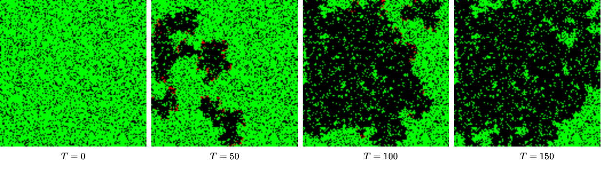

# Gym Forest Fire
Forest fire simulation and [Gym](https://github.com/openai/gym) environment
for tackling wildfires with reinforcement learning. The simulation largely follows the
[forest-fire model](https://en.wikipedia.org/wiki/Forest-fire_model) of 
[Drossel and Schwabl (1992)](https://journals.aps.org/prl/abstract/10.1103/PhysRevLett.69.1629)
which defines the forest fire model as a cellular automaton on a grid with L<sup>d</sup> 
cells, where L is the sidelength of the grid and d is its dimension. 

A cell can have three states: empty, occupied by a tree or burning. The Drossel and 
Schwabl (1992) model is then defined by four rules executed simultaneously:
1. A burning cell turns into an empty cell.
1. A tree will burn with probability q if at least one neighbor is burning.
1. A tree ignites with probability f even if no neighbor is burning.
1. An empty space fills with a tree with probability p.

The figure below shows snapshots of the forest fire simulation. 


## Markov Decision Process Formulation
The problem of controlling the forest fire is modeled as a Markov Decision Process (MDP):
* **States:** An aerial image of the forest showing trees, fires, and empty cells. 
This is a `128x128` Numpy array with `0` as empty cells, `1` as trees and `10` as the fire cells.
* **Actions:** The coordinates `[x, y]` of the fire team. The action space 
is continuous and is normalized to `[0, 1]`. The fire team puts out any fire that exists
within a certain radius of `[x, y]`.
* **Rewards:** At every step, if the fire team has put out any fire, the agent gets a
reward of `1`, but if there is a fire in the forest and the fire team has not put out any
fire, the agent gets a reward of `-1`. At the final step, if the total trees alive are more 
than 50% of the initial tree population, the agent gets a reward of `100`, otherwise it gets
a reward of `-100`.
* **Transition Probability:** The environment is modeled following the Drossel and 
Schwabl (1992) forest-fire model as discussed above.

**Note:** A good policy should ideally learn when to let the fire burn trees and when to 
put it out.   

## Dependencies 
This code has very few dependencies and the simulation is fully vectorized for faster
computation.  

Requirements:
* Python 3.5+
* OpenAI Gym
* Numpy 
* OpenCV (for rendering the environment)

## Instructions
### Setup
Clone the package and install it using `pip`. This install the package and all of its 
requirements.
```
From ~/gym_forestfire/
pip install -e .
```
The environment will be registered in the Gym registry. So you can create an instance by
simply calling `gym.make()`. You can pass `env_kwargs` for modifying the environment 
properties. 
```
import gym

env = gym.make('gym_forestfire:ForestFire-v0')
env.reset()

for _ in range(500):
    env.render()
    a = env.action_space.sample()
    s, r, d, _ = env.step(a)
env.close()
```

### Training
The TD3 algorithm with CNN-based actor and critic has been implemented based on [author's implementation](https://github.com/sfujim/TD3). 
To train, simply run:
```
python main.py --env gym_forestfire:ForestFire-v0
```

## Refrences 
1. [Drossel B, Schwabl F. Self-organized critical forest-fire model. Physical review letters. 1992 Sep 14;69(11):1629.](https://journals.aps.org/prl/abstract/10.1103/PhysRevLett.69.1629)
1. [Wiering, M. A., Dorigo, M., Haasis, H. D., & Ranze, K. C. (1998). Learning to Control Forest Fires. In Proceedings of the 12th International Symposium on Computer Science for Environmental Protection (UI'98) (pp. 378-388). Metropolis Verlag.](https://dspace.library.uu.nl/handle/1874/23510) 
1. [Brockman G, Cheung V, Pettersson L, Schneider J, Schulman J, Tang J, Zaremba W. Openai gym. arXiv preprint arXiv:1606.01540. 2016 Jun 5.](https://arxiv.org/abs/1606.01540)
1. [Fujimoto, S., Hoof, H., & Meger, D. (2018, July). Addressing Function Approximation Error in Actor-Critic Methods. In International Conference on Machine Learning (pp. 1587-1596).](http://proceedings.mlr.press/v80/fujimoto18a.html)
1. [Rolnick D, Donti PL, Kaack LH, Kochanski K, Lacoste A, Sankaran K, Ross AS, Milojevic-Dupont N, Jaques N, Waldman-Brown A, Luccioni A. Tackling climate change with machine learning. arXiv preprint arXiv:1906.05433. 2019 Jun 10.
](https://arxiv.org/abs/1906.05433)
1. [Blog post: Game of Life in NumPy. URL: http://drsfenner.org/blog/2015/08/game-of-life-in-numpy-2/](http://drsfenner.org/blog/2015/08/game-of-life-in-numpy-2/)
